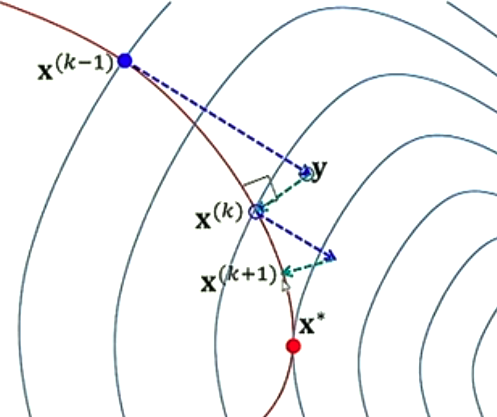

# Projected Gradient Descent

Useful for constrained optim.

Under a feasible region (assumed convex) F, a projection is defined as

    x = projF(y) = argmin||y-x|| for x € F

y projected into feasible set F

## The projected gradient descent

The algoritm becomes

    prev_x = initial_guess()
    x_min = prev_x

    for k in range(1:n):
        g = - grad(f(prev_x))                   # Choose negative gradient as search direction
        lambda = argmin(f(x_prev) + lambda*g)   # Determine optimal step size
        y = prev_x + lambda * g            # Perform update
        # Becase y might not be feasible, find its projection on F. That will be the starting point for the next iteration.
        next_x = projection(y, F)

